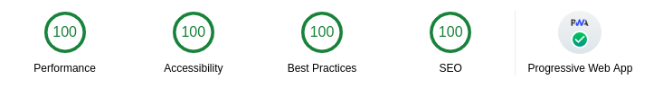

# broadcat-site

**Author:** Jason Miani

## Todo List

### Todo Items

> [!IMPORTANT]
>
> -   set siteConfig.js values to variables. Data should come from .json file instead. This will allow the user > to set values in CMS and then push data to json file.
> -   colorScheme.js accepts optional color choices. Otherwise, we use default options
> -   Import gatsby-theme-apollo PageNav, Layout
> -   Add GraphQL queries && Map GraphQL data to pages

### Completed

> [!]
>
> -   create color variables in colorScheme.js
> -   create siteConfig.json example so I know how to structure my data
> -   create working gatsby site
> -   Configure Twitch Integration

---

## webDev Environment Setup

### vscode

-   Install [Visual Studio Code](https://code.visualstudio.com/)

--> slightly different than Visual Studio. VSCode's extension library is massive. I'll send you my list.

### git

install [git](https://git-scm.com/)

options:

-   add to path

-   chocolatey (if win)

-   _use recommended settings_

//NOTE: \*\*vscode has git built in so you dont technically need but i highly recommend

**setup global git config**

[Git Tutorial & git config --global](https://www.atlassian.com/git/tutorials)

### nodejs, npm & yarn

-   install [node](https://nodejs.org/en/)

> python-based javascript runtime

**use lts or current**

-   install npm [npm aka node package manager](https://www.npmjs.com/)

    > npm is the redhot sauce of javascript. it does everything

-   install [yarn](https://yarnpkg.com/lang/en/)

> this extends from npm and has same functionality as npm. required for many installs. its faster, easer to use, less security risks **did i mention easier to use?**

## Getting Started

clone the github repo

> \$ git clone https://github.com/jasontmiani/broadcat-site.git

make a copy of the master branch so that you can break stuff.

> \$ git checkout -b some_branch_name

this duplicated the og branch but just to be sure lets check

> \$ git status

commit changes

> \$ git commit -m "insert message"

ill show you rest later. theres also info listed below

#### **common npm/yarn usage examples**

looks for package.json file and installs all dependencies

> \$ npm install

> \$ yarn

> \$ yarn install

add a project dependency

> \$ npm install react --save

> \$ yarn add react

> \$ yarn install react

adds a dev dependency to the project

> \$ npm i eslint --save-dev

> \$ yarn add eslint --dev

install a package globally

> \$ npm install --global gatsby-cli

> \$ yarn add --global gatsby-cli

> \$ yarn install --global gatsby-cli

**npx** (works with yarn & npm)

creates a temporary react project bundled **probs wont use this**

> \$ npx create-react-app my-app

**npm scripts**

**_ each package.json file in workspace "/" has a scripts list so its important to read these _**

here's the most common script listed in package.json

here's how to start gatsby in dev mode lol

> \$ npm run-script dev

> \$ npm dev

> \$ yarn develop

## docs & other Links

-   [Gatsby Advanced Starter](https://github.com/Vagr9K/gatsby-advanced-starter)

    -   I chose this starter as it's bare bones --> it's much easier to add components to a project than to remove/replace components & variables IMO.
    -   Starter offers a ton of functionality but most importantly NetlifyCMS _content management system_ out of box, SEO configured pages, automatic pagination, and native [Netlify](https://www.netlify.com/) deploy. CI/CD through github.

-   [Gatsby Documentation](https://www.gatsbyjs.org/)

    > Gatsby uses the latest & greatest tech to produce static websites. There are about 5 other major static site generators.

    **Gatsby Benefits**

    1. Statically generated html/css/js --> safe, secure, & fast af at very low cost <= \$1 per site (at scale of like 20+ sites; initially free.)
    2. ReactJS for component modularity/flexibility. Dozens of design systems work with react --> in most instances we won't have to build components or configure css.

    3. GraphQL --> an alternative integration method to an API. ideal for SSGens.

    4. Gatsby plugins - preconfigured to do almost anything see [Gatsby Plugins](https://www.gatsbyjs.org/plugins/)

-   [ReactJS Documentation](https://reactjs.org/docs/hooks-intro.html)

    -   I linked the **hooks** _functional reactjs components_ documentation. React will stop using class-based components moving forward and working with functions is much easier IMO.

    -   I'll show you how to use react via the Example.js component. Inline comments for dev tutorial. It's not that complicated and allows us to use design systems so we'll mostly have to think about integrating stuff not writing HTML/CSS

---

## Original starter project

i already modified tons of packages and added quokkajs

# Gatsby Advanced Starter

A starter skeleton with advanced features for [Gatsby](https://github.com/gatsbyjs/gatsby/).

**NOTE**: This branch contains Gatsby v2 compatible version of the starter. To get the Gatsby v1 compatible version, use the [`v1`](https://github.com/Vagr9K/gatsby-advanced-starter/tree/v1) branch.

## Lighthouse Audit Score

<div align="center">
    <a href="https://developers.google.com/web/tools/lighthouse/">
      
    </a>
</div>

Check out the [Features](#features) to read about all [Progressive Web App](https://developers.google.com/web/progressive-web-apps) capabilities of this starter in detail.

## Why?

This project aims to provide a minimal base for building advanced GatsbyJS powered websites.

It doesn't define any UI limitations in any way and only gives you the basic components for SEO/Social Media/etc while creating a comfortable development environment to get started.

You are free to use any UI framework/styling options.

## How can I use this?

If you are a newcomer to Gatsby who's interested in the implementations of most needed features, this is a great place to start.

If you are interested in a foundation for building ultra-fast websites, you can use this project as a "minimal" starter.

[Demo website.](https://gatsby-advanced-starter-demo.netlify.com)

## Features

-   Gatsby v2 support
-   Blazing fast loading times thanks to pre-rendered HTML and automatic chunk loading of JS files
-   Posts in Markdown
    -   Code syntax highlighting
    -   Embed YouTube videos
    -   Embed Tweets
-   Pagination
    -   Configurable via `SiteConfig.js`
-   Tags
    -   Separate page for posts under each tag
-   Categories
    -   Separate page for posts under each category
-   [Disqus](https://disqus.com/) support
    -   Notifications about new disqus comments
-   `/static/` and content folders are available to use with [gatsby-image](https://www.gatsbyjs.org/docs/gatsby-image/) out of the box for optimized image generation
-   High configurability
-   Separate components for everything:
    -   User social profiles
    -   Copyright information
    -   More!
-   [NetlifyCMS](https://www.netlifycms.org) support out of the box
-   PWA features
    -   Offline support
    -   Web App Manifest support
    -   Loading progress for slow networks
-   SEO
    -   [Google Analytics](https://marketingplatform.google.com/about/analytics/) support
    -   Sitemap generation
    -   robots.txt
    -   General description tags
    -   [Schema.org JSONLD (Google Rich Snippets)](https://schema.org/)
    -   [OpenGraph Tags (Facebook/Google+/Pinterest)](https://ogp.me/)
    -   [Twitter Tags (Twitter Cards)](https://developer.twitter.com/en/docs/tweets/optimize-with-cards/overview/markup)
-   RSS feeds
-   Social features
    -   Twitter tweet button
    -   Facebook share/share count
    -   Reddit share/share count
    -   LinkedIn share button
    -   Telegram share button
-   Development tools
    -   [ESLint](https://eslint.org/) for linting
    -   [Prettier](https://prettier.io/) for code formatting
    -   Remark-Lint for linting Markdown
    -   write-good for linting English prose
    -   gh-pages for deploying to GitHub pages
    -   [Netlify](https://www.netlify.com/) deploy configuration
    -   [CodeClimate](https://codeclimate.com/) configuration file and badge

NOTE: Feel free to check out [Gatsby Material Starter](https://github.com/Vagr9K/gatsby-material-starter) if you are interested in a more opinionated starter with Material Design in mind.

````

## Configuration

Edit the export object in `data/SiteConfig`:

```js
module.exports = {
  siteTitle: "Gatsby Advanced Starter", // Site title.
  siteTitleShort: "GA Starter", // Short site title for homescreen (PWA). Preferably should be under 12 characters to prevent truncation.
  siteTitleAlt: "GatsbyJS Advanced Starter", // Alternative site title for SEO.
  siteLogo: "/logos/logo-1024.png", // Logo used for SEO and manifest.
  siteUrl: "https://gatsby-advanced-starter-demo.netlify.com", // Domain of your website without pathPrefix.
  pathPrefix: "/", // Prefixes all links. For cases when deployed to example.github.io/gatsby-advanced-starter/.
  siteDescription: "A GatsbyJS stater with Advanced design in mind.", // Website description used for RSS feeds/meta description tag.
  siteRss: "/rss.xml", // Path to the RSS file.
  siteFBAppID: "1825356251115265", // FB Application ID for using app insights
  googleAnalyticsID: "UA-47311644-5", // GA tracking ID.
  disqusShortname: "https-vagr9k-github-io-gatsby-advanced-starter", // Disqus shortname.
  postDefaultCategoryID: "Tech", // Default category for posts.
  dateFromFormat: "YYYY-MM-DD", // Date format used in the frontmatter.
  dateFormat: "DD/MM/YYYY", // Date format for display.
  postsPerPage: 4, // Amount of posts displayed per listing page.
  userName: "Advanced User", // Username to display in the author segment.
  userEmail: "AdvancedUser@example.com", // Email used for RSS feed's author segment
  userTwitter: "", // Optionally renders "Follow Me" in the UserInfo segment.
  userLocation: "North Pole, Earth", // User location to display in the author segment.
  userAvatar: "https://api.adorable.io/avatars/150/test.png", // User avatar to display in the author segment.
  userDescription:
    "Yeah, I like animals better than people sometimes... Especially dogs. Dogs are the best. Every time you come home, they act like they haven't seen you in a year. And the good thing about dogs... is they got different dogs for different people.", // User description to display in the author segment.
  // Links to social profiles/projects you want to display in the author segment/navigation bar.
  userLinks: [
    {
      label: "GitHub",
      url: "https://github.com/Vagr9K/gatsby-advanced-starter",
      iconClassName: "fa fa-github"
    },
    {
      label: "Twitter",
      url: "https://twitter.com/Vagr9K",
      iconClassName: "fa fa-twitter"
    },
    {
      label: "Email",
      url: "mailto:vagr9k@gmail.com",
      iconClassName: "fa fa-envelope"
    }
  ],
  copyright: "Copyright © 2019. Advanced User", // Copyright string for the footer of the website and RSS feed.
  themeColor: "#c62828", // Used for setting manifest and progress theme colors.
  backgroundColor: "#e0e0e0" // Used for setting manifest background color.
};
````

If want to customize Netlify CMS, e.g. registering custom widgets or styling the preview pane, you can do so by editing `src/netlifycms/index.js`:

```js
import CMS from "netlify-cms-app";

CMS.init({
    config: {
        backend: {
            name: "git-gateway"
        }
    }
});
```

You can also optionally set `pathPrefix`:

```js
module.exports = {
    // Note: it must *not* have a trailing slash.
    pathPrefix: "/gatsby-advanced-starter" // Prefixes all links. For cases when deployed to example.github.io/gatsby-advanced-starter/.
};
```

WARNING: Make sure to edit `static/robots.txt` to include your domain for the sitemap!

# Author

Ruben Harutyunyan ([@Vagr9K](https://twitter.com/Vagr9K))
